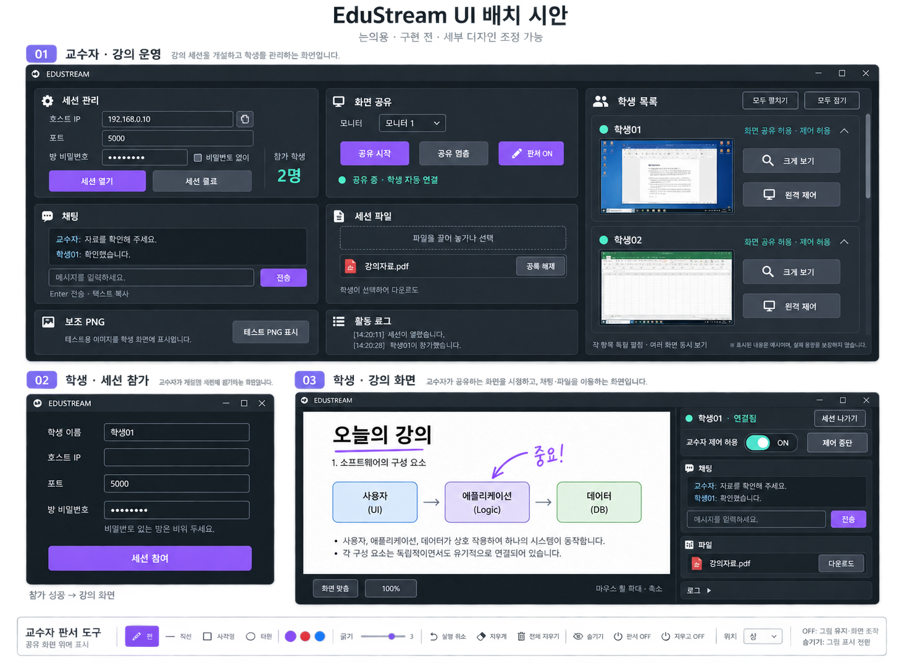

# UI·RDP 사용자 피드백 확정 기준

정리일: 2026-09-18. 기준 실행 코드: `e1592f0` (#46, 실행 코드/배포는 #44 기준). **이 문서는 확정한 요구사항과 시안이며 새 기능 구현 완료 기록이 아닙니다.** #45의 계획은 #46으로 되돌렸으며, 아래 최신 합의가 그 계획을 대체합니다.

## 1. UI 참고 시안

사용자가 승인한 배치 참고용 생성 이미지입니다. 작은 글자·예시 데이터보다 아래 동작 명세가 우선합니다. UI 담당자는 간격·크기·색상·카드 높이를 조정할 수 있지만 합의한 기능/흐름 변경은 팀장에게 확인합니다. 하단 판서 도구는 설명용 확대 예시이며 학생용 도구가 아닙니다. 학생 2명은 검증 시작 기준이지 무제한 지원을 뜻하지 않습니다.

## 2. 이번 구현 범위

### U01 교수자 화면

- 왼쪽 운영 영역의 상단은 **세션 관리 / RDP 화면 공유**, 중단은 **채팅 / 세션 파일**, 하단은 **보조 PNG / 활동 로그**를 좌우 배치합니다.
- 오른쪽은 학생 목록 전용입니다. 기존 오른쪽 채팅·파일·로그는 왼쪽으로 옮깁니다.
- 세션 이름 입력과 교수자 자기 화면 미리보기는 제거합니다. 내부 세션 ID까지 없애는 것은 아닙니다.
- 교수자에게 접속용 호스트 IP·포트·복사 기능, 참가 상태/인원을 표시합니다. NIC/VPN/루프백 주소는 구분하고 인터넷 접속 가능 주소라고 단정하지 않습니다.

### U02 학생 참가/강의 화면

- 처음 실행: 학생 이름, 호스트 IP, 기본값이 있는 포트, 방 비밀번호, 세션 참여 버튼. 비밀번호 없는 방은 비워 둡니다.
- 참가 성공 후 강의 화면으로 전환합니다. 왼쪽은 교수자 공유 화면, 오른쪽은 **채팅 → 파일 → 로그** 세로 배치입니다. 별도 설정 탭은 제거합니다.
- 로그의 접기/펼치기, Shift+Enter 줄바꿈은 시안의 사용성 제안으로 조정 가능합니다.
- 학생 개발자 테스트/파일 수신 테스트, 별도 RDP 비밀번호·연결·재접속 버튼은 제거합니다. 참가 후 공유 대기/연결/오류 상태는 표시합니다.
- 세션 나가기는 참가 화면으로 복귀합니다. 원격 제어 허용과 즉시 중단 기능은 설정 탭과 함께 사라지지 않게 접속 상태 근처에 둡니다.

### U03 방 비밀번호·자동 접속·공유 재시작

- 교수자가 **방 비밀번호 하나**를 설정하거나 비밀번호 없이 방을 엽니다. 학생별 비밀번호 복사/전달 흐름은 사용자 화면에서 제거합니다.
- 승인된 세션 참가 시 RDP 연결은 자동입니다. 교수자 공유 전에는 대기하며, 공유 시작 시 자동 표시합니다.
- 공유 멈춤은 강의 종료가 아닙니다. 채팅·파일·참가 상태를 유지하고 재시작 시 학생 조작/비밀번호 재입력 없이 자동 복귀합니다.
- 내부 재초대가 필요해도 사용자에게 조작을 요구하지 않습니다. 새 연결 식별자, 오래된 이벤트 거부, 초대 소유자 검증은 유지합니다.
- 실제 퇴장·허용 철회·강의 종료 후 자동 복귀하지 않습니다. 새 참가와 기존 세션 내 화면 재연결을 구분합니다.

### U04 화면 해상도·모니터·휠 확대축소

- 주사율/FPS 고정 요구가 아니라 **공유 모니터의 해상도와 표시 비율** 요구입니다.
- 공유할 모니터 선택을 제공하고 원본 비율을 유지합니다. 학생 화면은 기본적으로 창 크기/배치에 맞춰 전체 공유 화면을 보여 줍니다. 비율 차이에 따른 여백은 허용하되 늘림·잘림은 피합니다.
- 공유 화면 위 마우스 휠로 확대/축소하며 확대 시 화면 이동, 화면 맞춤 복귀를 제공합니다. 기본 맞춤에서 원하는 구역을 찾기 위해 스크롤할 필요가 없어야 합니다.
- 서로 다른 해상도/DPI와 듀얼 모니터 좌표를 검증합니다. 실제 WDS 화면에서 동작해야 하며 PNG 표시만 고쳐 완료로 처리하지 않습니다.
- 캡처처럼 드래그로 일부 영역을 지정해 공유하는 기능은 **보류**입니다.

### U05 교수자 판서

- 교수자 공유 화면 위에 직접 그려 **학생 수신 화면에도 함께 보이도록** 합니다. 별도 흰 그림판이나 교수자 미리보기 방식이 아닙니다.
- 그리기 아이콘으로 판서 ON/OFF, 도구 모음 상·하·좌·우 배치, 자유선·직선·기본 도형, 색상·굵기, 지우개, 실행 취소, 전체 지우기.
- **판서 OFF:** 그림은 계속 보이고 마우스는 원래 화면 조작으로 복귀합니다.
- **숨기기:** 삭제 없이 숨김/다시 표시를 전환합니다. 학생에게 보이는 판서도 같은 표시 상태여야 합니다.
- **지우고 OFF:** 그림을 모두 삭제하고 원래 화면 조작으로 복귀합니다.
- 전체 지우기는 판서만 삭제합니다. 실행 취소가 그리기·지우기·전체 지우기에서 일관되도록 이력 경계를 검증합니다. 세션 종료/모니터 전환 시 판서 보존 범위는 구현 전 계약에서 명시합니다.

### U06 학생 목록·다중 화면 보기

- 기본 목록은 이름·접속 상태를 표시합니다. 이름을 클릭하면 작은 실시간 학생 화면과 **크게 보기 / 원격 제어** 버튼이 펼쳐집니다.
- 다른 학생을 펼쳐도 기존 항목은 접히지 않습니다. 같은 이름을 다시 누르면 해당 항목만 접습니다. 여러 학생 화면을 동시에 볼 수 있습니다.
- 목록 상단에 **모두 펼치기 / 모두 접기**, 목록이 길어지면 세로 스크롤을 제공합니다. 접기는 참가자 연결 종료가 아닙니다.
- 크게 보기는 별도 큰 보기 영역/창에서 표시합니다. 이름 클릭·크게 보기만으로 입력 제어를 활성화하지 않습니다.
- 실제 학생 화면 송신/교수자 수신 기능이 필요합니다. 기존 교수자→학생 화면 공유만으로 구현 완료로 처리하지 않습니다.

### U07 교수자 원격 제어와 학생 권한

- 학생의 교수자 제어 허용은 **기본 ON**입니다. 참가 시 이 사실을 알리고 학생에게 허용 상태·현재 제어 중인 상태를 명확히 표시합니다. 학생은 허용 OFF·즉시 중단이 가능합니다.
- 교수자가 원하는 학생을 선택하고 원격 제어 ON을 눌렀을 때 해당 학생의 화면을 보며 마우스·키보드로 조작합니다. OFF는 제어만 종료하고 강의 접속은 유지합니다.
- 여러 화면 동시 보기와 별개로 입력 제어 대상은 한 번에 한 학생을 기본 설계로 합니다. 대상 전환 시 이전 제어를 회수합니다. 다른 항목을 펼치는 것만으로 대상이 바뀌지 않습니다.
- 학생은 교수자나 타 학생을 제어할 수 없습니다. UI를 숨기는 데 그치지 않고 방향·신원·권한을 서비스에서 검증합니다.
- 세션 참가 범위의 기능입니다. 앱 종료 뒤 상시 접속, 몰래 관찰, 녹화/저장 기능은 요구하지 않았으며 추가하지 않습니다. 학생 화면 보기/허용 상태도 학생에게 알립니다.
- 학생 화면이 교수자 공유 화면에 의도치 않게 다시 송출되지 않도록 구성/표시 방식과 중단 동작을 검증합니다. 보장하지 못하는 배치는 경고·공유 중지 등 안전한 동작으로 처리하며 검증 전 자동 제외를 약속하지 않습니다.

### U08 세션 파일 등록·선택 다운로드

- 교수자는 선택 또는 외부 파일 드래그로 세션 목록에 등록합니다. 등록 즉시 모든 학생에게 파일 본문을 보내지 않습니다.
- 학생이 파일명 또는 다운로드 버튼을 누르면 해당 파일을 요청하여 실제 Windows 다운로드 폴더에 저장합니다.
- 교수자가 등록 해제하면 학생 목록에서도 제거되고 신규 다운로드 요청은 거부됩니다. 교수자 원본과 학생이 이미 다운로드한 파일은 삭제하지 않습니다.
- 진행/완료/실패, 같은 이름 충돌, 권한·잠금·checksum 실패와 재시도를 처리합니다. 등록 해제와 이미 진행 중인 다운로드의 경합 정책은 1·2·4번 계약에서 먼저 정합니다.

### U09 채팅·기타 편의

- Enter 전송, 학생도 메시지 선택·복사 가능. 한글 IME 조합 중 오발송을 방지합니다.
- 같은 PC에서 학생이 먼저 실행 중이면 교수자 실행을 막고 이유를 안내합니다. 교수자를 먼저 실행한 경우 학생 실행은 허용합니다. 동시 시작/비정상 종료/다른 Windows 로그인 범위는 기술 확인 후 명시합니다.
- 설치형과 ZIP형 기능을 동일하게 유지합니다. UI 변경 후 양쪽 배포 후보 실행을 검증합니다.

## 3. 보류·제외·현재 한계

- 보류: 일부 영역 드래그 공유, 상단에 잠시 뜨는 공지, 참가 인원 확대.
- 제외: 세션 이름 입력, 교수자 자기 공유 미리보기, 학생 테스트 UI·수동 RDP 연결/초대 비밀번호 UI, 학생의 타 PC 제어.
- 판서·학생 화면 동시 보기·교수자 원격 제어는 **이번 신규 구현 범위로 승격**됐습니다. #45의 후순위 분류를 재사용하지 않습니다.
- 현재 기존 코드의 활성 WDS 초대 제한은 2명입니다. 새 양방향 구성의 성능은 미검증이며 우선 교수자 1명·학생 2명의 동시 표시/제어/파일·채팅으로 검증합니다. 모든 학생 펼치기 UI를 인원 무제한 보장으로 해석하지 않습니다.
- 기본 기능 정상 동작은 팀장 확인으로 기록합니다. PC 수·15분 실행·실측 지연 등의 증빙까지 제출됐다고 확대하지 않습니다.

## 4. 원문 피드백 대조

| 원문 | 요청 | 최신 반영 |
|---|---|---|
| 01 | 캡처식 영역 공유 | U04, 보류로 변경 |
| 02 | 확대축소 | U04, 마우스 휠 |
| 03 | 교수자 미리보기·그림판 | 미리보기 제외 / U05 판서 포함 |
| 04 | UI 간소화 | U01·U02 |
| 05 | 창 크기·화면 비율 | U04, 해상도 요구로 정정 |
| 06 | 잠시 표시되는 공지 | 보류 |
| 07 | 앱 실행 순서 제한 | U09 |
| 08 | 비밀번호 지정·미설정 | U03 |
| 09 | 교수자의 학생 PC 개입 | U07, 신규 범위 포함 |
| 10 | 허용 학생 선택 후 입력 제어 | U07, 기본 허용 ON·중단 가능 |
| 11 | 학생 화면 공유·모니터링 | U06·U07, 여러 화면 동시 보기 |
| 12 | 수용 인원 | 3절, 기존 2명 검증 기준·확대 보류 |
| 13 | 학생 다운로드 버튼·다운로드 폴더 | U08 |
| 14 | 파일명 클릭 다운로드 | U08 |
| 15 | 듀얼 모니터 설정 | U04 |
| 16 | 학생 간섭 기능 제외 | U07, 학생→타 PC 제어 금지 |
| 17 | 학생 채팅 복사 | U09 |
| 18 | 방 단위 비밀번호·재입력 제거 | U03 |
| 19 | 호스트 IP 표시 | U01 |
| 20 | Enter 전송 | U09 |
| 21 | 학생 탭 묶기 | U02, 참가 화면 분리 후 채팅/파일/로그 단일 세로 패널로 변경 |
| 22 | 개발자·파일 수신 테스트 제거 | U02 |
| 23 | 공유 재시작 때 연결 유지 | U03, 강의 유지·화면 자동 복귀 |
| 24 | 파일 드래그 등록 | U08 |
| 25 | 교수자 좌우 배치 | U01, 오른쪽은 학생 목록 전용 |

후속 합의도 포함: 세션 이름 제거(U01), 참가 화면 분리(U02), 주사율→해상도 정정(U04), 판서 OFF/숨김/삭제 구분(U05), 학생 개별·전체 펼침(U06), 등록 해제(U08). 일정/담당은 [역할 배분](./UI_RDP_WORK_ALLOCATION.md)과 [현재 로드맵](./STATUS_AND_ROADMAP.md)을 따릅니다.
